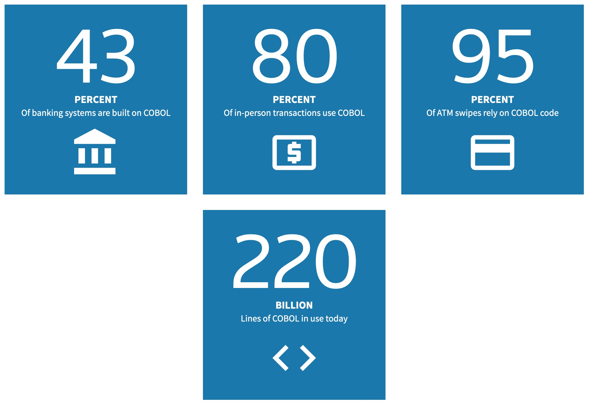

 

# Legacy Serverless Modernization: Cobol and AWS Lambda functions


* [Goal](README.md#goal)
* [Cobol](README.md#cobol)
* [Lambda Functions and Serverless Architecture](README.md#lambda-functions-and-serverless-architecture)
* [Serverless Application Model](README.md#serverless-application-model)
* [Workflow and Components](README.md#workflow-and-components)
* [Fork and Setup](README.md#fork-and-setup)
* [Execution Highlights](README.md#execution-highlights)


## Goal

This repository implements a fully automated [Github Workflow](https://docs.github.com/en/actions/reference/workflow-syntax-for-github-actions) to deploy 
and run as an [AWS Lambda function](https://aws.amazon.com/lambda/) a ['Hello World' Cobol program](hello-world.cob) compiled with [GnuCOBOL](https://en.wikipedia.org/wiki/GnuCOBOL). 
GnuCOBOL compiles the source code as a native x86 module depending on the libcob library. Both are packaged and uploaded as a [custom Lambda runtime](https://docs.aws.amazon.com/lambda/latest/dg/runtimes-walkthrough.html)
by the workflow. The workflow is scheduled by cron on a minimalweekly basis to make sure that it keeps working.

The [benefits of the serverless architecture](https://aws.amazon.com/lambda/serverless-architectures-learn-more/) are not reserved to newly written 
applications. The purpose of this showcase is to demonstrate how those benefits can be combined with legacy code, still "doing the job" and 
delivering solid business value, to further extend its life.

The deployed Cobol program is accessible over http via the definition of a REST service on the [AWS API gateway](https://aws.amazon.com/api-gateway/). The results of the various executions of the workflow in this repo can be seen in [Actions](https://github.com/didier-durand/lambda-cobol/actions) tab here above. Also, some highlights of last execution are reported in last section of this page.

This initial use case will be refined in upcoming versions by adding a database, calling subprograms, etc.

Lambda functions were chosen here because they are the canonical service proposed by AWS [to support the strategic serverless architecture](https://aws.amazon.com/serverless/). 
Its virtues are described below. Lambdas can execute [uninterruptedly at scale](https://aws.amazon.com/blogs/compute/operating-lambda-application-design-scaling-and-concurrency-part-2/) 
with no effort on the customer side. 

The purpose of this unusual / unexpected use case with Cobol is to trigger further ideas around "serverless legacy". The Cobol numbers 
below will demonstrate that it makes quite a lot of sense to reuse the massive existing assets on a modern cloud platform to further extend their 
life and leverage them in new ways. It's especially attractive given the incredibly affordable costs of Lambdas when compared to costs of mainframe Mips!

Feel free to fork and replicate this repo in your own environment (see Setup section below). All feedback and suggestions for extensions welcome! (Please, open a [Github issue ticket](https://github.com/didier-durand/lambda-cobol/issues) for this purpose). If you like this repository, please, give it a star!

## Cobol

[Cobol](https://en.wikipedia.org/wiki/COBOL) was initially specified more than 60 years ago by [Grace Hopper](https://en.wikipedia.org/wiki/Grace_Hopper), 
aka "the grandmother of Cobol". This language remains quite vivid despite its age. It is still heavily used in [mainframe shops](https://en.wikipedia.org/wiki/Mainframe_computer) 
like banks, insurance companies, administrations, etc.

For example, issues at the beginning of the Covid-19 pandemic have shown how critical this programming language remains to run daily operations in 
US administrations. Old Cobol applications are still heavily used by several states to [process unemployment claims](https://www.shrm.org/hr-today/news/hr-news/pages/desperate-need-for-cobol-programmers-underlines-importance-of-workforce-planning.aspx).

A [report of 2017 by Thomson Reuters](http://fingfx.thomsonreuters.com/gfx/rngs/USA-BANKS-COBOL/010040KH18J/index.html) states that 200+ billion 
lines of Cobol are still in operation. It also asserts that 43% of banking systems are built on Cobol and that 95% of ATM swipes rely on this language.

<p align="center">
<a href="http://fingfx.thomsonreuters.com/gfx/rngs/USA-BANKS-COBOL/010040KH18J/index.html">

</a>
</p>
<p align="center">
<b>Cobol Use in Finance Service Industry (Thomson Reuters)</b>
</p>

And this importance is not going to decline anytime soon: [IBM reports](https://techchannel.com/Enterprise/10/2019/closing-cobol-programming-skills-gap) that more than 5 billion additional lines are produced each year!

## Lambda Functions and Serverless Architecture

<p align="center">

</p>
<p align="center">
<b>Canonical Lambda architecture (Python example)</b>
</p>

As per AWS documentation: *"AWS Lambda is a serverless compute service that lets you run code without provisioning or managing servers, 
creating workload-aware cluster scaling logic, maintaining event integrations, or managing runtimes. With Lambda, you can run code for virtually 
any type of application or backend service - all with zero administration. Just upload your code as a ZIP file or container image, and 
Lambda automatically and precisely allocates compute execution power and runs your code based on the incoming request or event, for any scale of 
traffic."*

It means that AWS Lambda service does the heavyweight lifting to the benefit of its users: all the [non-functional requirements (NFRs)](https://en.wikipedia.org/wiki/Non-functional_requirement) 
like high availability, scalability, security, resource and performance optimization, etc. are implemented by the AWS experts. Customer teams can 
remain focused on functional code and rely on this scalable platform to run their applications uninterruptedly at scale.

This serverless architecture is the optimal solution to run applications with very stringent [SLAs](https://en.wikipedia.org/wiki/Service-level_agreement) 
(incl. extremely low [RTO](https://en.wikipedia.org/wiki/Disaster_recovery#Recovery_Time_Objective) & [RPO](https://en.wikipedia.org/wiki/Disaster_recovery#Recovery_Point_Objective)). 
Those highly demanding SLAs are usually out of reach of most organizations by themselves. With Lambdas, it become extremely easy as AWS encapsulates 
its domain expertise in the underlying platform design and makes the thorough investments to deploy and operate the underlying infrastructure 
in a multi-tenant fashion. 

Additionally, the service strictly respects the "pay-per-use" model: AWS will charge only for the memory consumption and 
execution time of executed Lambdas. If they remain unused, no cost!

These virtues of serverless architecture make it the ideal target when the functional needs and technical requirements allow for it. It should be the 
primary goal of any corporate cloud architect to make maximum use of managed serverless features.

## Serverless Application Model

AWS open sourced at end of 2016 the [Serverless Application Model (SAM) framework](https://github.com/aws/serverless-application-model) to [describe 
such serverless applications](https://docs.aws.amazon.com/serverless-application-model/latest/developerguide/what-is-sam.html) made of multiple 
Lamdba functions with all their dependencies. The main purpose of SAM is to reduce the effort by developers when creating such applications. 
Required artefacts and definitions are specified at a high-level of abstraction. The SAM processor on AWS, in collaboration with the 
[CloudFormation service](https://aws.amazon.com/cloudformation/), which it extends, will take care of all the low-level definitions of corresponding required AWS resources to deploy the Lambda function and make it 
publicly accessible through the API gateway. 

This allows the implementation of [Infrastructure-as-Code](https://en.wikipedia.org/wiki/Infrastructure_as_code) best practices.

The SAM model for our Cobol Lambda is in the file [lambda-cobol-sam.yaml](lambda-cobol-sam.yaml). It contains a single [AWS::Serverless::Function](https://docs.aws.amazon.com/serverless-application-model/latest/developerguide/sam-resource-function.html) with its parameters. During deployment, SAM & CloudFormation expand it into 6 more granular resources that can be located with "Resource creation Initiated" in last section below.

## Workflow and Components

Implemented as a Github Action, the workflow  - scripted in [lambda-cobol.sh](lambda-cobol.sh) - comprises following key steps:

1) A Docker image [is constructed](Dockerfile) to install the GnuCOBOL compiler and its dependencies on top of the base Amazon Linux image. The 
purpose of such a container is to leverage the isolation provided by containers. Consequently, the build environment is fully controlled.
2) This Cobol builder imports the source code of [hello-world.cob](hello-world.cob) and compiles it to generate an x86 native binary named ```hello-world```.
3) This binary is packaged, via SAM CLI, with other required runtime artefacts. The libcob library is required by GnuCOBOL. The shell script ```bootstrap```(name 
imposed by specifications) implements the requirements of [custom Lambda runtimes](https://docs.aws.amazon.com/lambda/latest/dg/runtimes-walkthrough.html).
4) This package is deployed on the Lambda service via [SAM CLI](https://docs.aws.amazon.com/serverless-application-model/latest/developerguide/serverless-sam-cli-install.html).
5) The SAM description is processed by AWS Lambda and CloudFormation to deploy the function.
6) SAM CLI is used to check proper deployment.
7) SAM CLI invokes the function synchronously.
8) curl calls the URL with the obtained DNS to validate the proper execution of the newly deployed Lambda. The URL for curl is built   following template: https://$API_ID.execute-api.$AWS_REGION.amazonaws.com/Prod/$LAMBDA_NAME. $API_ID is dynamic and obtained via a ```aws apigateway get-rest-apis``` CLI command.

When a previous deployment of the CloudFormation stack is active, it gets deleted just before the SAM build to trigger the entire CloudFormation deployment process.

**Note:** the version of GnuCOBOL currently used is v2.2. A [version 3.1 was published](https://sourceforge.net/projects/gnucobol/files/gnucobol/) in late December, 2020. But, its libcob runtime library has hardwired dependencies on very recent Linux system libraries, that are not yet available with proper version in Lambda runtime. We'll bump to newest GnuCOBOL when Lambda runtime gets updated. The official repository for all available versions of GnuCOBOL is [here]( https://ftp.gnu.org/gnu/gnucobol/?C=M;O=D).

## Fork and Setup  

When you fork this repository to run it on your own, you will need to recreate three [Github secrets](https://docs.github.com/en/actions/configuring-and-managing-workflows/using-variables-and-secrets-in-a-workflow) in your own repository for workflows to work properly: 

- ${{ secrets.AWS_ACCESS_KEY_ID }}: the access key under which the workflow will run
- ${{ secrets.AWS_SECRET_ACCESS_KEY }}: the secret key validating the use of the above access key
- ${{ secrets.AWS_REGION }}: the region in which you want the workflow to be deployed and executed

The credentials given to this identity via [AWS IAM](https://aws.amazon.com/iam/) must grant permissions to deploy and run Lambda functions as well 
as create corresponding API gateway definitions. In addition, an S3 bucket must be created to import the uploaded artefacts in AWS when they get deployed.

## Execution Highlights

Below are the logs of the last execution related to the Lamdba service operated from SAM CLI:


```
 
### execution date: Thu Jul 21 01:36:27 UTC 2022
 
### Check existing Lambdas functions...
{
    "Functions": [
        {
            "FunctionName": "Hello-world-Python",
            "FunctionArn": "arn:aws:lambda:us-east-1:514764745669:function:Hello-world-Python",
            "Runtime": "python3.8",
            "Role": "arn:aws:iam::514764745669:role/service-role/Hello-world-Python-role-lyqky200",
            "Handler": "lambda_function.lambda_handler",
            "CodeSize": 299,
            "Description": "",
            "Timeout": 3,
            "MemorySize": 128,
            "LastModified": "2021-02-06T10:48:38.267+0000",
            "CodeSha256": "fI06ZlRH/KN6Ra3twvdRllUYaxv182Tjx0qNWNlKIhI=",
            "Version": "$LATEST",
            "TracingConfig": {
                "Mode": "PassThrough"
            },
            "RevisionId": "d90d1b6d-667c-46d9-b9d5-e7fdefdfc004",
            "PackageType": "Zip",
            "Architectures": [
                "x86_64"
            ],
            "EphemeralStorage": {
                "Size": 512
            }
        }
    ]
}
 
### Starting SAM build...

Build Succeeded

Built Artifacts  : build
Built Template   : build/template.yaml

Commands you can use next
=========================
[*] Validate SAM template: sam validate
[*] Invoke Function: sam local invoke -t build/template.yaml
[*] Test Function in the Cloud: sam sync --stack-name {stack-name} --watch
[*] Deploy: sam deploy --guided --template-file build/template.yaml
        
 
### Starting SAM deployment...

	Deploying with following values
	===============================
	Stack name                   : lambda-cobol-stack
	Region                       : us-east-1
	Confirm changeset            : False
	Disable rollback             : False
	Deployment s3 bucket         : net.didier-durand.lambda-code
	Capabilities                 : ["CAPABILITY_IAM"]
	Parameter overrides          : {}
	Signing Profiles             : {}

Initiating deployment
=====================

Waiting for changeset to be created..
CloudFormation stack changeset
-------------------------------------------------------------------------------------------------
Operation                LogicalResourceId        ResourceType             Replacement            
-------------------------------------------------------------------------------------------------
+ Add                    HelloWorldCobolGetReso   AWS::Lambda::Permissio   N/A                    
                         urcePermissionProd       n                                               
+ Add                    HelloWorldCobolRole      AWS::IAM::Role           N/A                    
+ Add                    HelloWorldCobol          AWS::Lambda::Function    N/A                    
+ Add                    ServerlessRestApiDeplo   AWS::ApiGateway::Deplo   N/A                    
                         ymentaf1c952223          yment                                           
+ Add                    ServerlessRestApiProdS   AWS::ApiGateway::Stage   N/A                    
                         tage                                                                     
+ Add                    ServerlessRestApi        AWS::ApiGateway::RestA   N/A                    
                                                  pi                                              
-------------------------------------------------------------------------------------------------

Changeset created successfully. arn:aws:cloudformation:us-east-1:514764745669:changeSet/samcli-deploy1658367521/808fee11-1ede-4029-bc55-94f1ea5b0ec5


2022-07-21 01:38:53 - Waiting for stack create/update to complete

CloudFormation events from stack operations (refresh every 0.5 seconds)
-------------------------------------------------------------------------------------------------
ResourceStatus           ResourceType             LogicalResourceId        ResourceStatusReason   
-------------------------------------------------------------------------------------------------
CREATE_IN_PROGRESS       AWS::IAM::Role           HelloWorldCobolRole      -                      
CREATE_IN_PROGRESS       AWS::IAM::Role           HelloWorldCobolRole      Resource creation      
                                                                           Initiated              
CREATE_COMPLETE          AWS::IAM::Role           HelloWorldCobolRole      -                      
CREATE_IN_PROGRESS       AWS::Lambda::Function    HelloWorldCobol          -                      
CREATE_IN_PROGRESS       AWS::Lambda::Function    HelloWorldCobol          Resource creation      
                                                                           Initiated              
CREATE_COMPLETE          AWS::Lambda::Function    HelloWorldCobol          -                      
CREATE_IN_PROGRESS       AWS::ApiGateway::RestA   ServerlessRestApi        -                      
                         pi                                                                       
CREATE_IN_PROGRESS       AWS::ApiGateway::RestA   ServerlessRestApi        Resource creation      
                         pi                                                Initiated              
CREATE_COMPLETE          AWS::ApiGateway::RestA   ServerlessRestApi        -                      
                         pi                                                                       
CREATE_IN_PROGRESS       AWS::ApiGateway::Deplo   ServerlessRestApiDeplo   -                      
                         yment                    ymentaf1c952223                                 
CREATE_IN_PROGRESS       AWS::Lambda::Permissio   HelloWorldCobolGetReso   -                      
                         n                        urcePermissionProd                              
CREATE_IN_PROGRESS       AWS::Lambda::Permissio   HelloWorldCobolGetReso   Resource creation      
                         n                        urcePermissionProd       Initiated              
CREATE_IN_PROGRESS       AWS::ApiGateway::Deplo   ServerlessRestApiDeplo   Resource creation      
                         yment                    ymentaf1c952223          Initiated              
CREATE_COMPLETE          AWS::ApiGateway::Deplo   ServerlessRestApiDeplo   -                      
                         yment                    ymentaf1c952223                                 
CREATE_IN_PROGRESS       AWS::ApiGateway::Stage   ServerlessRestApiProdS   -                      
                                                  tage                                            
CREATE_IN_PROGRESS       AWS::ApiGateway::Stage   ServerlessRestApiProdS   Resource creation      
                                                  tage                     Initiated              
CREATE_COMPLETE          AWS::ApiGateway::Stage   ServerlessRestApiProdS   -                      
                                                  tage                                            
CREATE_COMPLETE          AWS::Lambda::Permissio   HelloWorldCobolGetReso   -                      
                         n                        urcePermissionProd                              
CREATE_COMPLETE          AWS::CloudFormation::S   lambda-cobol-stack       -                      
                         tack                                                                     
-------------------------------------------------------------------------------------------------

Successfully created/updated stack - lambda-cobol-stack in us-east-1

 
 
### Inkoking deployed Lambda synchronously from CLI...
{
    "StatusCode": 200,
    "ExecutedVersion": "$LATEST"
}
invocation result:

  {
    "isBase64Encoded": false,
    "statusCode": 200, 
    "body": "Hello World from COBOL!" 
  } 
 
### Obtaining API gateway config...
{
    "items": [
        {
            "id": "hn6pnx1oz0",
            "name": "lambda-cobol-stack",
            "createdDate": "2022-07-21T01:39:31+00:00",
            "version": "1.0",
            "apiKeySource": "HEADER",
            "endpointConfiguration": {
                "types": [
                    "EDGE"
                ]
            },
            "tags": {
                "aws:cloudformation:logical-id": "ServerlessRestApi",
                "aws:cloudformation:stack-id": "arn:aws:cloudformation:us-east-1:514764745669:stack/lambda-cobol-stack/da3725f0-0895-11ed-b4f9-12793982cf31",
                "aws:cloudformation:stack-name": "lambda-cobol-stack"
            },
            "disableExecuteApiEndpoint": false
        }
    ]
}
api id: hn6pnx1oz0
 
### Running curl https request to https://hn6pnx1oz0.execute-api.us-east-1.amazonaws.com/Prod/lambda-cobol-hello-world ...
Hello World from COBOL! 
```
